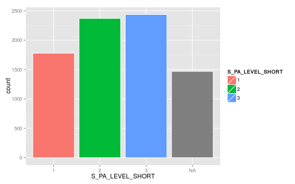
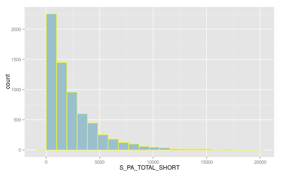
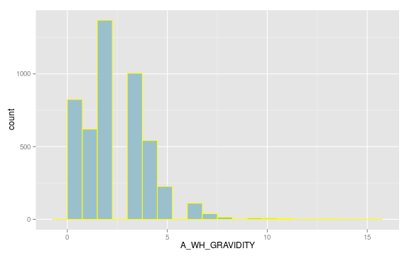
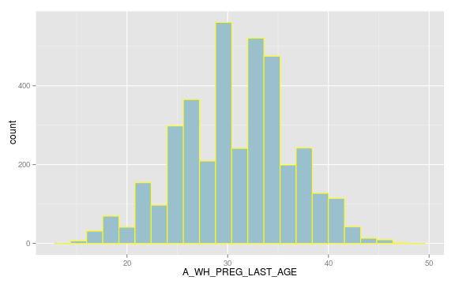
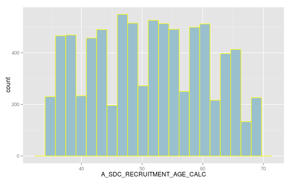
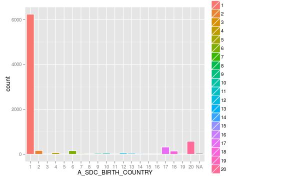

---
output:
  knitrBootstrap::knit_bootstrap:
    encoding: UTF-8
    input: "opal-table.Rmd"
    boot_style: flatly
    chooser: NULL
    thumbsize: 7
---

# Harmonized dataset report for <code class="knitr inline">OHS2_coreqx</code>

 

Name of the report     | Harmonized dataset report for <code class="knitr inline">OHS2_coreqx</code>
---------------------- | -------------------
Project                | <code class="knitr inline">CoreQx_Final</code>
Table                  | <code class="knitr inline">OHS2_coreqx</code>
Number of variables    | <code class="knitr inline">9</code>
Number of participants | <code class="knitr inline">8053</code>
Date                   | <code class="knitr inline">2014-12-01</code>

## Variables

* [S_PA_LEVEL_LONG](#S_PA_LEVEL_LONG)
* [S_PA_LEVEL_SHORT](#S_PA_LEVEL_SHORT)
* [S_PA_TOTAL_LONG](#S_PA_TOTAL_LONG)
* [S_PA_TOTAL_SHORT](#S_PA_TOTAL_SHORT)
* [A_WH_GRAVIDITY](#A_WH_GRAVIDITY)
* [A_WH_PREG_LAST_AGE](#A_WH_PREG_LAST_AGE)
* [A_SDC_RECRUITMENT_AGE_CALC](#A_SDC_RECRUITMENT_AGE_CALC)
* [S_WRK_JOB_TITLE_CUR_OPEN](#S_WRK_JOB_TITLE_CUR_OPEN)
* [A_SDC_BIRTH_COUNTRY](#A_SDC_BIRTH_COUNTRY)

<code class="knitr inline">
### <code class="knitr inline">S_PA_LEVEL_LONG</code>

#### Properties

Property         | Value  
---------------- | ----------------
label            | <code class="knitr inline">Total physical activity level </code>
definition       | <code class="knitr inline">Categorical indicator of the participant's level of physical activity (IPAQ long form).</code>
Value type       | <code class="knitr inline">integer</code>
Unit             | 
Entity type      | <code class="knitr inline">Participant</code>

#### Attributes

Property         | Value  
-----------------| ----------------
Mlstr_harmo:status      | <code class="knitr inline">impossible</code>

#### Categories

Name | Label | Missing
---------------- | ---------------- | ----------------
1 | Low level of physical activity | 
2 | Moderate level of physical activity | 
3 | High level of physical activity | 

#### Statistics
All participants are missing values: No statistics available

### <code class="knitr inline">S_PA_LEVEL_SHORT</code>

#### Properties

Property         | Value  
---------------- | ----------------
label            | <code class="knitr inline">Total physical activity level </code>
definition       | <code class="knitr inline">Categorical indicator of the participant's level of physical activity (IPAQ short form)</code>
Value type       | <code class="knitr inline">integer</code>
Unit             | 
Entity type      | <code class="knitr inline">Participant</code>

#### Attributes

Property         | Value  
-----------------| ----------------
Mlstr_harmo:status      | <code class="knitr inline">complete</code>

#### Categories

Name | Label | Missing
---------------- | ---------------- | ----------------
1 | Low level of physical activity | 
2 | Moderate level of physical activity | 
3 | High level of physical activity | 

<code class="knitr inline">
#### Statistics

Descriptive Statistic | Value
--------------------- | ----------------
N                     | <code class="knitr inline">6585</code>
Mode                  | <code class="knitr inline">3</code>

Category | Frequency | %
---------------- | ---------------- | ----------------
1 | 1778 | 27| 
2 | 2370 | 35.99| 
3 | 2437 | 37.01| 
Missing | 1468 | 22.29| 

</code>

### <code class="knitr inline">S_PA_TOTAL_LONG</code>

#### Properties

Property         | Value  
---------------- | ----------------
label            | <code class="knitr inline">Total physical activity MET-minutes/week </code>
definition       | <code class="knitr inline">Quantitative indicator of global physical activity in metabolic equivalent (MET)-minutes per week (IPAQ long form).  Total physical activity MET-minutes/week = sum of Walking + Moderate + Vigorous MET-minutes/week scores</code>
Value type       | <code class="knitr inline">decimal</code>
Unit             | <code class="knitr inline">MET-minutes/week</code>
Entity type      | <code class="knitr inline">Participant</code>

#### Attributes

Property         | Value  
-----------------| ----------------
Mlstr_harmo:status      | <code class="knitr inline">impossible</code>

#### Statistics
All participants are missing values: No statistics available

### <code class="knitr inline">S_PA_TOTAL_SHORT</code>

#### Properties

Property         | Value  
---------------- | ----------------
label            | <code class="knitr inline">Total physical activity MET-minutes/week </code>
definition       | <code class="knitr inline">Quantitative indicator of global physical activity in metabolic equivalent (MET)-minutes per week (IPAQ short form).  Total physical activity MET-minutes/week = sum of Walking + Moderate + Vigorous MET-minutes/week scores</code>
Value type       | <code class="knitr inline">decimal</code>
Unit             | <code class="knitr inline">MET-minutes/week</code>
Entity type      | <code class="knitr inline">Participant</code>

#### Attributes

Property         | Value  
-----------------| ----------------
Mlstr_harmo:status      | <code class="knitr inline">complete</code>

<code class="knitr inline">
#### Statistics

Descriptive Statistic | Value
--------------------- | ----------------
N                     | <code class="knitr inline">6585</code>
Min                   | <code class="knitr inline">0</code>
Max                   | <code class="knitr inline">1.9278 &times; 104</code>
Mean                  | <code class="knitr inline">2397.5223083</code>
Median                | <code class="knitr inline">1588.5</code>
Standard Deviation    | <code class="knitr inline">2587.0096053</code>
Variance              | <code class="knitr inline">6.6926187 &times; 106</code>
Skewness              | <code class="knitr inline">2.1555069</code>
Kurtosis              | <code class="knitr inline">6.4103641</code>
Sum                   | <code class="knitr inline">1.5787684 &times; 107</code>
Sum of squares        | <code class="knitr inline">8.1915527 &times; 1010</code>

 

Value| Frequency| Subtotal percentage|Total percentage
----- | --------| -------------------| ---------------
__Non-missing__ |      |      |      |
Not empty |6585|100% |81.77%
__Missing__    |       |      |       |
N/A |1468|100% |18.23%
Total |1468|100% |18.23%

</code>

### <code class="knitr inline">A_WH_GRAVIDITY</code>

#### Properties

Property         | Value  
---------------- | ----------------
label            | <code class="knitr inline">Gravidity </code>
definition       | <code class="knitr inline">Total number of times a female participant has been pregnant.</code>
Value type       | <code class="knitr inline">integer</code>
Unit             | <code class="knitr inline">pregnancies</code>
Entity type      | <code class="knitr inline">Participant</code>

#### Attributes

Property         | Value  
-----------------| ----------------
Mlstr_harmo:status      | <code class="knitr inline">complete</code>

<code class="knitr inline">
#### Statistics

Descriptive Statistic | Value
--------------------- | ----------------
N                     | <code class="knitr inline">4775</code>
Min                   | <code class="knitr inline">0</code>
Max                   | <code class="knitr inline">15</code>
Mean                  | <code class="knitr inline">2.300733</code>
Median                | <code class="knitr inline">2</code>
Standard Deviation    | <code class="knitr inline">1.6993399</code>
Variance              | <code class="knitr inline">2.8877561</code>
Skewness              | <code class="knitr inline">0.9839547</code>
Kurtosis              | <code class="knitr inline">2.7683199</code>
Sum                   | <code class="knitr inline">10986</code>
Sum of squares        | <code class="knitr inline">3.9062 &times; 104</code>

 

Value| Frequency| Subtotal percentage|Total percentage
----- | --------| -------------------| ---------------
__Non-missing__ |      |      |      |
Not empty |4775|100% |59.29%
__Missing__    |       |      |       |
N/A |3278|100% |40.71%
Total |3278|100% |40.71%

</code>

### <code class="knitr inline">A_WH_PREG_LAST_AGE</code>

#### Properties

Property         | Value  
---------------- | ----------------
label            | <code class="knitr inline">Age at last pregnancy </code>
definition       | <code class="knitr inline">Age of the female participant when she last became pregnant.</code>
Value type       | <code class="knitr inline">integer</code>
Unit             | <code class="knitr inline">years</code>
Entity type      | <code class="knitr inline">Participant</code>

#### Attributes

Property         | Value  
-----------------| ----------------
Mlstr_harmo:status      | <code class="knitr inline">complete</code>

#### Categories

Name | Label | Missing
---------------- | ---------------- | ----------------
-7 | Not applicable | 

<code class="knitr inline">
#### Statistics

Descriptive Statistic | Value
--------------------- | ----------------
N                     | <code class="knitr inline">3815</code>
Min                   | <code class="knitr inline">15</code>
Max                   | <code class="knitr inline">47</code>
Mean                  | <code class="knitr inline">30.674443</code>
Median                | <code class="knitr inline">31</code>
Standard Deviation    | <code class="knitr inline">5.5162832</code>
Variance              | <code class="knitr inline">30.4293808</code>
Skewness              | <code class="knitr inline">-0.1621148</code>
Kurtosis              | <code class="knitr inline">-0.2690444</code>
Sum                   | <code class="knitr inline">117023</code>
Sum of squares        | <code class="knitr inline">3.705673 &times; 106</code>

 

Value| Frequency| Subtotal percentage|Total percentage
----- | --------| -------------------| ---------------
__Non-missing__ |      |      |      |
Not empty |3815|100% |47.37%
__Missing__    |       |      |       |
-7|824|19.44%|10.23%
N/A |3414|80.56% |42.39%
Total |4238|100% |52.63%

</code>

### <code class="knitr inline">A_SDC_RECRUITMENT_AGE_CALC</code>

#### Properties

Property         | Value  
---------------- | ----------------
label            | <code class="knitr inline">Age </code>
definition       | <code class="knitr inline">Participant's age at questionnaire completion, calculated from birth date and date of questionnaire completion.</code>
Value type       | <code class="knitr inline">integer</code>
Unit             | 
Entity type      | <code class="knitr inline">Participant</code>

#### Attributes

Property         | Value  
-----------------| ----------------
Mlstr_harmo:status      | <code class="knitr inline">complete</code>

<code class="knitr inline">
#### Statistics

Descriptive Statistic | Value
--------------------- | ----------------
N                     | <code class="knitr inline">8053</code>
Min                   | <code class="knitr inline">35</code>
Max                   | <code class="knitr inline">69</code>
Mean                  | <code class="knitr inline">51.1418105</code>
Median                | <code class="knitr inline">51</code>
Standard Deviation    | <code class="knitr inline">9.4838219</code>
Variance              | <code class="knitr inline">89.9428778</code>
Skewness              | <code class="knitr inline">0.033026</code>
Kurtosis              | <code class="knitr inline">-1.0957097</code>
Sum                   | <code class="knitr inline">411845</code>
Sum of squares        | <code class="knitr inline">2.1786719 &times; 107</code>

 

Value| Frequency| Subtotal percentage|Total percentage
----- | --------| -------------------| ---------------
__Non-missing__ |      |      |      |
Not empty |8053|100% |100%
__Missing__    |       |      |       |
N/A |0|0% |0%
Total |0|0% |0%

</code>

### <code class="knitr inline">S_WRK_JOB_TITLE_CUR_OPEN</code>

#### Properties

Property         | Value  
---------------- | ----------------
label            | <code class="knitr inline">Current job title </code>
definition       | <code class="knitr inline">Participant's current job title - open text. </code>
Value type       | <code class="knitr inline">text</code>
Unit             | 
Entity type      | <code class="knitr inline">Participant</code>

#### Attributes

Property         | Value  
-----------------| ----------------
Mlstr_harmo:status      | <code class="knitr inline">complete</code>

### <code class="knitr inline">A_SDC_BIRTH_COUNTRY</code>

#### Properties

Property         | Value  
---------------- | ----------------
label            | <code class="knitr inline">Participant's country of birth</code>
definition       | <code class="knitr inline">Country where the participant was born.</code>
Value type       | <code class="knitr inline">integer</code>
Unit             | 
Entity type      | <code class="knitr inline">Participant</code>

#### Attributes

Property         | Value  
-----------------| ----------------
Mlstr_harmo:status      | <code class="knitr inline">complete</code>

#### Categories

Name | Label | Missing
---------------- | ---------------- | ----------------
1 | Canada | 
2 | China | 
3 | France | 
4 | Germany | 
5 | Greece | 
6 | India | 
7 | Islamic Republic of Iran | 
8 | Ireland | 
9 | Italy | 
10 | Jamaica | 
11 | Republic of Korea | 
12 | Philippines | 
13 | Poland | 
14 | Portugal | 
15 | Russian Federation | 
16 | Ukraine | 
17 | United Kingdom | 
18 | United States | 
19 | Viet Nam | 
20 | Other | 

<code class="knitr inline">
#### Statistics

Descriptive Statistic | Value
--------------------- | ----------------
N                     | <code class="knitr inline">8009</code>
Mode                  | <code class="knitr inline">1</code>

Category | Frequency | %
---------------- | ---------------- | ----------------
1 | 6239 | 77.9| 
2 | 163 | 2.04| 
3 | 15 | 0.19| 
4 | 70 | 0.87| 
5 | 11 | 0.14| 
6 | 154 | 1.92| 
7 | 28 | 0.35| 
8 | 20 | 0.25| 
9 | 36 | 0.45| 
10 | 44 | 0.55| 
11 | 14 | 0.17| 
12 | 52 | 0.65| 
13 | 38 | 0.47| 
14 | 28 | 0.35| 
15 | 27 | 0.34| 
16 | 15 | 0.19| 
17 | 321 | 4.01| 
18 | 143 | 1.79| 
19 | 15 | 0.19| 
20 | 576 | 7.19| 
Missing | 44 | 0.55| 

</code>

</code>

